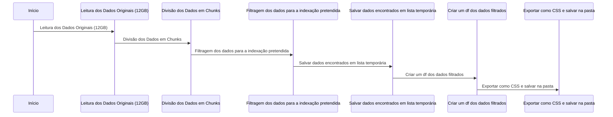
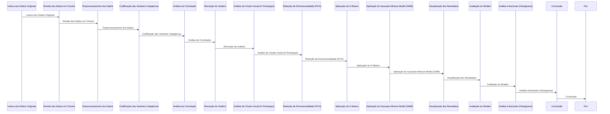

# Documentação do Processo de Análise de Clusterização e Modelagem de Dados

## 1. Extração e Pré-processamento dos Dados

O conjunto de dados original possuía mais de 12GB de dados, o que tornava impossível carregá-los completamente na memória usando ferramentas tradicionais ou gratuitas. Para lidar com esse volume de dados, foi adotada a técnica de **extração em chunks**, permitindo processar os dados em blocos menores, evitando sobrecarregar a memória e otimizando o tempo de processamento.

### 1.1. Extração de Dados

Devido ao tamanho significativo dos dados, utilizou-se a técnica de **extração em chunks**. Os dados são lidos em pedaços menores, processando-os progressivamente, o que evita o uso excessivo de memória e permite que o sistema trabalhe de forma eficiente, mesmo com grandes volumes de informações.

Cada **chunk** de dados é carregado, processado e descartado antes do carregamento do próximo, mantendo o uso de memória baixo e viável mesmo com o tamanho gigantesco do conjunto de dados.

### 1.2. Codificação de Variáveis Categóricas

Após a extração dos dados, as variáveis categóricas foram codificadas utilizando o método **Label Encoding**. Isso converte as variáveis não numéricas (como categorias de fase de vida, sexo e estado nutricional) em valores numéricos, permitindo que o modelo as entenda corretamente. O processo de codificação foi crucial para preparar as variáveis categóricas para a análise.

As variáveis codificadas foram:
- `DS_FASE_VIDA` (Fase de Vida)
- `SG_SEXO` (Sexo)
- `CO_ESTADO_NUTRI` (Estado Nutricional)

### 1.3. Exclusão de Colunas Desnecessárias

Em seguida, colunas que não são relevantes para a análise, como identificadores e datas, foram removidas. As colunas excluídas incluem:
- `CO_CNES`
- `DT_ACOMPANHAMENTO`
- `NU_COMPETENCIA`

Essas colunas não contribuem para a clusterização e foram descartadas para otimizar o desempenho e reduzir o tamanho dos dados a serem processados.

### 1.4. Normalização dos Dados

A normalização foi aplicada às variáveis numéricas para garantir que todas as características contribuam igualmente para a análise. Utilizou-se o **StandardScaler** para padronizar as variáveis numéricas, como:
- `NU_IDADE_ANO` (Idade)
- `NU_PESO` (Peso)
- `NU_ALTURA` (Altura)
- `DS_IMC` (Índice de Massa Corporal)

Essa etapa foi crucial para garantir que as variáveis numéricas estivessem na mesma escala, evitando que variáveis com escalas maiores dominassem o modelo.

### 1.5. Detecção e Remoção de Outliers

Após a normalização, foram identificados e removidos os **outliers** utilizando o **Z-score**. Observações cujos Z-scores das variáveis numéricas estavam maiores que 3 ou menores que -3 foram removidas. Isso ajudou a eliminar os dados aberrantes, que poderiam distorcer os resultados da análise e afetar a precisão dos modelos de clusterização.

## 2. Análise de Correlação

A análise de correlação foi essencial para entender as relações entre as variáveis selecionadas, ajudando a determinar a importância de cada variável para a clusterização.

### 2.1. Cálculo da Correlação

A correlação de Spearman foi utilizada para medir a força e a direção da associação entre variáveis numéricas e ordinais. As variáveis analisadas foram:
- `NU_IDADE_ANO`
- `DS_FASE_VIDA`
- `SG_SEXO`
- `NU_PESO`
- `NU_ALTURA`
- `DS_IMC`
- `CO_ESTADO_NUTRI`

### 2.2. Visualização da Correlação

A correlação de Spearman foi visualizada em um gráfico de calor, onde os valores de correlação entre as variáveis foram representados em cores, facilitando a interpretação das interações entre as variáveis e ajudando a identificar padrões relevantes para a análise de clusterização.

## 3. Análise de Clusterização

A análise de clusterização foi realizada utilizando diferentes abordagens, como **K-Prototypes**, **K-Means** e **Gaussian Mixture Model (GMM)**. Essas técnicas permitiram segmentar os dados em clusters e identificar padrões que poderiam não ser imediatamente visíveis.

### 3.1. K-Prototypes

O **K-Prototypes** foi utilizado para realizar a clusterização de dados mistos (numéricos e categóricos). Esse modelo foi escolhido para lidar com as variáveis categóricas, como a fase de vida, sexo e estado nutricional, que são comuns em dados médicos.

#### 3.1.1. Método do Cotovelo

Para determinar o número ideal de clusters, foi utilizado o **Método do Cotovelo**. Este método avalia a **inércia** (ou custo) para diferentes valores de **k** (número de clusters), identificando o ponto onde a inércia começa a diminuir a uma taxa mais lenta. O número de clusters ideal foi aquele que apresentou a menor inércia com um aumento mínimo após esse ponto.

#### 3.1.2. Aplicação do K-Prototypes

Após determinar o número adequado de clusters, o **K-Prototypes** foi aplicado aos dados normalizados para identificar grupos semelhantes dentro do conjunto de dados. O modelo foi configurado para lidar com as variáveis categóricas e numéricas simultaneamente.

#### 3.1.3. Adição dos Rótulos de Cluster

Os rótulos de clusters gerados pelo modelo foram adicionados ao DataFrame original, permitindo que as observações fossem agrupadas de acordo com os clusters identificados.

### 3.2. PCA com K-Prototypes

A **Análise de Componentes Principais (PCA)** foi aplicada para reduzir a dimensionalidade dos dados numéricos e facilitar a visualização dos clusters. O PCA foi realizado nas variáveis numéricas para gerar componentes principais que simplificaram a análise e ajudaram na interpretação visual dos resultados.

Após a redução de dimensionalidade, o **K-Prototypes** foi novamente aplicado nos dados transformados pelo PCA para realizar a clusterização. O uso do PCA ajudou a visualizar os clusters em um espaço de menor dimensão, facilitando a análise dos resultados.

### 3.3. K-Means

O **K-Means** foi aplicado para comparar os resultados obtidos com o **K-Prototypes**. Essa técnica de clusterização é amplamente utilizada para segmentar dados em grupos, com a vantagem de ser mais simples de entender e aplicar.

#### 3.3.1. Método do Cotovelo

Assim como no **K-Prototypes**, o **Método do Cotovelo** foi utilizado para determinar o número ideal de clusters. O número de clusters foi ajustado com base na inércia do modelo K-Means, buscando o ponto onde a inércia começava a diminuir lentamente.

#### 3.3.2. Aplicação do K-Means

Após determinar o número ideal de clusters, o **K-Means** foi aplicado aos dados normalizados para realizar a clusterização. Os rótulos de clusters gerados pelo modelo foram então adicionados ao DataFrame, permitindo a análise dos grupos formados.

### 3.4. PCA com K-Means

Para facilitar a visualização dos clusters gerados pelo **K-Means**, foi aplicada a **PCA** nos dados normalizados. O PCA ajudou a reduzir a dimensionalidade dos dados, permitindo uma visualização clara dos clusters em um gráfico de dispersão (scatter plot).

#### 3.4.1. Visualização dos Clusters

Os clusters gerados pelo **K-Means** foram visualizados em um gráfico de dispersão em 2D, onde cada ponto foi colorido de acordo com o cluster ao qual pertence, proporcionando uma análise visual eficiente dos resultados de clusterização.

### 3.5. Gaussian Mixture Model (GMM)

O **Gaussian Mixture Model (GMM)** é um modelo probabilístico que modela os dados como uma mistura de distribuições gaussianas. Ao contrário do K-Means, que assume clusters esféricos, o GMM pode lidar com clusters de formas mais complexas e não esféricas.

#### 3.5.1. Aplicação de PCA e GMM

O **PCA** foi aplicado para reduzir a dimensionalidade dos dados numéricos e facilitar a visualização em 2D. Em seguida, o modelo **GaussianMixture** foi aplicado para realizar a clusterização probabilística. O número ideal de componentes foi determinado com base nos critérios **AIC** (Akaike Information Criterion) e **BIC** (Bayesian Information Criterion), escolhendo o número de componentes que minimiza ambos os critérios.

#### 3.5.2. Visualização dos Resultados

Os clusters gerados pelo **GMM** foram visualizados usando um **gráfico de histograma**, que permitiu a visualização da distribuição dos dados em cada cluster. O histograma facilitou a análise de como os dados estavam distribuídos dentro dos clusters e ajudou a compreender as características dos grupos formados pelo modelo probabilístico.

## 4. Bibliotecas Utilizadas

As bibliotecas Python utilizadas durante o processo de análise incluem:
- **Pandas**: Para manipulação e pré-processamento dos dados.
- **NumPy**: Para operações matemáticas e manipulação de arrays.
- **Matplotlib** e **Seaborn**: Para visualização de dados.
- **Scikit-learn**: Para a implementação de técnicas de clusterização e PCA.
- **K-Prototypes**: Para a implementação do algoritmo K-Prototypes.
- **GaussianMixture (sklearn.mixture)**: Para a implementação do Gaussian Mixture Model (GMM).

## 5. Ambiente de Desenvolvimento

A análise foi realizada utilizando as ferramentas de desenvolvimento:
- **Jupyter Lab**: Para a execução interativa de código Python, permitindo a visualização e análise dos resultados de forma eficiente.
- **Visual Studio Code (VSCode)**: Como editor de código para a escrita e organização do código Python e Jupyter Notebooks.7

## 6. Fluxo do trabalho

### 6.1. Obtenção dos dados 

### 6.2. Modelagem, benchmark e análise intracluster

## 7. Fonte dos Dados

Os dados utilizados neste estudo foram obtidos do **Ministério da Saúde** por meio da **Coordenação-Geral de Alimentação e Nutrição (CGAN)** e da **Coordenação Setorial de Tecnologia da Informação (COSTI)** da Secretaria de Atenção Primária à Saúde (SAPS). O acesso aos dados é facilitado pelo **Sistema de Vigilância Alimentar e Nutricional (Sisvan)**.

- **Dados de 2022** foram utilizados neste estudo.
- **Dicionário de Dados**: [Sisvan - Dicionário de Dados](https://s3.sa-east-1.amazonaws.com/ckan.saude.gov.br/SISVAN/estado_nutricional/Dicion%C3%A1rio+de+Dados+-+Estado+Nutricional.pdf)

## 8. Informações Gerais

- **Autor:** Rafael Rodrigues
- **Tipo de Estudo:** Estudo teórico não comercial
- **Fonte de Dados:** Dados Públicos
  
## 9. Referências

- Huang, H., Xu, Z., & Zeng, C. (2018). An Enhanced k-prototype Algorithm for Clustering Categorical Data, *Engineering Applications of Artificial Intelligence*, 71, 106-116.
- Huang, Z. (1998). Extensions to the k-Means Algorithm for Clustering Large Data Sets with Categorical Values, *Data Mining and Knowledge Discovery*, 2, 283–304.
- Jolliffe, I. T. (2002). *Principal Component Analysis*. Wiley.
- Hong, T.-P., Chen, C.-H., & Chang, C.-H. (2015). K-Prototypes: A Generalized Biclustering Algorithm, *IEEE Transactions on Knowledge and Data Engineering*, 27(3), 577-590.
- MacQueen, J. (1967). Some Methods for Classification and Analysis of Multivariate Observations, *Proceedings of the Fifth Berkeley Symposium on Mathematical Statistics and Probability*, 1, 281-297.
- Bishop, C. M. (2006). *Pattern Recognition and Machine Learning*. Springer.
